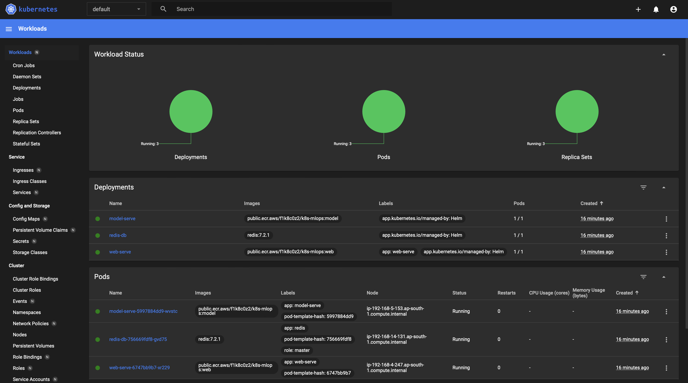
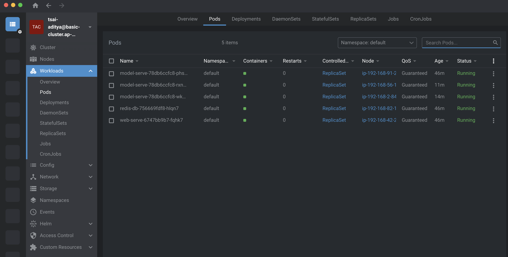

# Kubernetes - III: EKS, ALB, Auto Scaling

In this session, we deploy a GPT2 model on EKS. The application is exposed via an ALB (Ingress). Horizontal Pod Scaling is achieved as as well as Node Scaling. User's load testing has been done via Locust. The entire scaling aspect is shown via a video demonstration.

## Prerequisites

### EKS 
```bash
brew tap weaveworks/tap
brew install weaveworks/tap/eksctl
```

### Node Viewer
```bash
brew tap aws/tap
brew install eks-node-viewer
```

### AWS CLI
```bash
brew install awscli
```
We need to configure the AWS CLI to make sure we have access to creating EKS Cluster

```bash
aws configure
# verify the configuration of AWS CLI
aws sts get-caller-identity
```

```bash
# to get the account id 
aws sts get-caller-identity --query "Account" --output text
```

## Create EKS Cluster

```bash
eksctl create cluster -f eks-config.yaml
```

## Load Balancer Setup

### Enable OIDC Provider

```bash
eksctl utils associate-iam-oidc-provider --region ap-south-1 --cluster basic-cluster --approve

# attach policy
# from https://raw.githubusercontent.com/kubernetes-sigs/aws-load-balancer-controller/v2.6.0/docs/install/iam_policy.json
aws iam create-policy --policy-name AWSLoadBalancerControllerIAMPolicy --policy-document file://03_iam-policy.json
```

### IAM Role for Service Account

```bash
eksctl create iamserviceaccount \
--cluster=basic-cluster \
--namespace=kube-system \
--name=aws-load-balancer-controller \
--attach-policy-arn=arn:aws:iam::$Account_ID:policy/AWSLoadBalancerControllerIAMPolicy \
--override-existing-serviceaccounts \
--region ap-south-1 \
--approve
```

### Install AWS Load Balancer Controller

```bash
helm repo add eks https://aws.github.io/eks-charts
helm install aws-load-balancer-controller eks/aws-load-balancer-controller -n kube-system --set clusterName=${CLUSTER_NAME} --set serviceAccount.create=false --set serviceAccount.name=aws-load-balancer-controller
```

## Metrics Server

```bash
kubectl apply -f https://github.com/kubernetes-sigs/metrics-server/releases/latest/download/components.yaml

helm upgrade --install kubernetes-dashboard kubernetes-dashboard/kubernetes-dashboard --create-namespace --namespace kubernetes-dashboard
```

### Create a ServiceAccount and a RBAC

```bash
kubectl apply -f eks-admin.yaml
```

### Create a token and port forward to access the dashboard

```bash
kubectl -n kubernetes-dashboard create token admin-user
# forward port to your local system
kubectl port-forward svc/kubernetes-dashboard -n kubernetes-dashboard 6443:443
```

> Access the dashboard at https://localhost:6443

) 

## Cluster Autoscaler

### Create the IAM Policy for Cluster Auto Scaler

```bash
aws iam create-policy --policy-name AWSClusterAutoScalerIAMPolicy --policy-document file://cas-iam-policy.json
```

### Create IAM Role for Service Account (IRSA) for AWS Cluster AutoScaler

```bash
eksctl create iamserviceaccount \
--cluster=basic-cluster \
--namespace=kube-system \
--name=cluster-autoscaler \
--attach-policy-arn=arn:aws:iam::$Account_ID:policy/AWSClusterAutoScalerIAMPolicy \
--override-existing-serviceaccounts \
--region ap-south-1 \
--approve
```

### Deploy the Cluster Auto Scaler

```bash
# download the cluster autoscaler manifest
curl -o cluster-autoscaler-autodiscover.yaml https://raw.githubusercontent.com/kubernetes/autoscaler/master/cluster-autoscaler/cloudprovider/aws/examples/cluster-autoscaler-autodiscover.yaml
# deploy the cluster autoscaler
kubectl apply -f cluster-autoscaler-autodiscover.yaml
# verify the deployment
kubectl -n kube-system describe sa cluster-autoscaler
```

### Deploy the Horizontal Pod Autoscaler

```bash
kubectl apply -f hpa.yaml
```
> note when you do helm install `gpt2-eks . --values values.yaml` the hpa.yaml is already applied

## Deploy the GPT2 Model

```bash
cd fastapi-helm/
helm install gpt2-eks . --values values.yaml
```

### Lens Dashboard



## Load Testing

```bash
# install locust
pip install locust
# run locust
locust -f stress-testing.py
```

## Logs

- [kubectl get all -A -o yaml](https://github.com/aditya-AI/k8s-part3/blob/main/logs/all-resources.yaml)
- [kubectl top pod before load](https://github.com/aditya-AI/k8s-part3/blob/main/logs/top-pod-before-load.png)
- [kubectl top pod after load](https://github.com/aditya-AI/k8s-part3/blob/main/logs/top-pod-after-load.png)
- [kubectl describe your main ingress](https://github.com/aditya-AI/k8s-part3/blob/main/logs/describe-ingress.png)

## Demonstration of CA and HPA with EKS

[](https://youtu.be/HOGh991U-5o)

